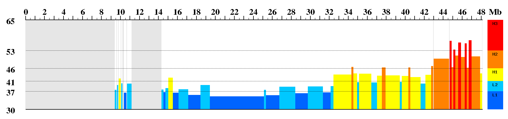

isoSegmenter
============

A program for segmenting genomes into isochores

[](https://pypi.python.org/pypi/isoSegmenter)

[](https://travis-ci.org/bunop/isoSegmenter)

[](https://coveralls.io/github/bunop/isoSegmenter?branch=master)

[](http://microbadger.com/images/bunop/isosegmenter "Get your own version badge on microbadger.com")

## License

isoSegmenter - A program for segmenting genomes into isochores

Copyright (C) 2013-2019 ITB - CNR

This program is free software: you can redistribute it and/or modify
it under the terms of the GNU General Public License as published by
the Free Software Foundation, either version 3 of the License, or
(at your option) any later version.

This program is distributed in the hope that it will be useful,
but WITHOUT ANY WARRANTY; without even the implied warranty of
MERCHANTABILITY or FITNESS FOR A PARTICULAR PURPOSE.  See the
GNU General Public License for more details.

You should have received a copy of the GNU General Public License
along with this program.  If not, see <http://www.gnu.org/licenses/>.

## Citation

If you use isoSegmenter in your work, please cite this manuscript:

> Cozzi P, Milanesi L, Bernardi G. Segmenting the Human Genome into Isochores. Evolutionary Bioinformatics 2015;11:253-261. [doi:10.4137/EBO.S27693](http://www.la-press.com/segmenting-the-human-genome-into-isochores-article-a5225)

## Requirements

isoSegmenter works on a Linux distribution with python 2.7 installed. Some python
libraries are needed by isoSegmenter:

* numpy
* gdmodule
* Pillow
* matplotlib
* biopython

You can install all those requirements by installing the appropriate Linux package for your distribution, or
by using pip. More information on installation are available in [INSTALL.md](https://github.com/bunop/isoSegmenter/blob/master/INSTALL.md#dependencies)

## Installation

isoSegmenter consist in a series of python scripts. You can install the software using git

```bash
$ git clone https://github.com/bunop/isoSegmenter.git
```

Then enter into isoSegmenter directory and install the package using pip (using python [virtualenv](http://docs.python-guide.org/en/latest/dev/virtualenvs/) is high recommeded). Note the final `.` after pip install. This will install packages inside current directory:

```bash
$ cd isoSegmenter
$ pip install .
```

To get more details on installation, please see [INSTALL.md](https://github.com/bunop/isoSegmenter/blob/master/INSTALL.md#installing-isosegmenter-using-git)

## Usage

`isoSegmenter.py` is the main application to execute isochores segmentation. It requires a single chromosome FASTA file as an input file (ONLY a chromosome inside a file). You can download genome sequences from [UCSC](http://hgdownload.soe.ucsc.edu/downloads.html), [EnsEMBL](http://www.ensembl.org/info/data/ftp/index.html) or [NCBI](ftp://ftp.ncbi.nlm.nih.gov/genomes/) FTP sites. Output files can be .CSV data file (importable in Excel) and .png image file. For example, inside isoSegmenter/test directory there is the Human chromosome 21 (hg19) as a packed FASTA file. We can call isoSegmenter to draw an image and to get the segmentation .csv file. Enter inside isoSegmenter and type:

```bash
$ isoSegmenter.py --infile test/chr21.fa.gz --outfile chr21.isochores.csv --graphfile chr21.isochores.png --draw_legend
```

`--infile`: This is the FASTA input file. It could be plain/text or compressed with gzip/bz2   
`--outfile`: This is the isochores .CSV output file   
`--graphfile`: This is the isochores .PNG output file   
`--draw_legend`: Draw a colored legend on the right side of the image

This will draw an image like this:



There are other options for manipulating graphs and segmentation, for instance you can change windows size or gap tolerance, if you need. You can get a brief description of them by running:

```bash
$ isoSegmenter.py --help
```
Others usage examples will be available (soon) on [isoSegmenter Wiki](https://github.com/bunop/isoSegmenter/wiki#isosegmenter-wiki)
